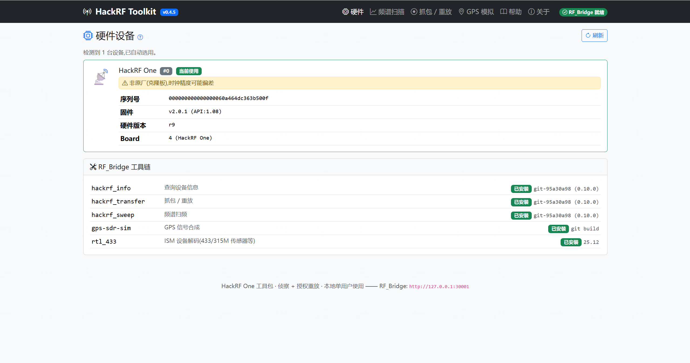
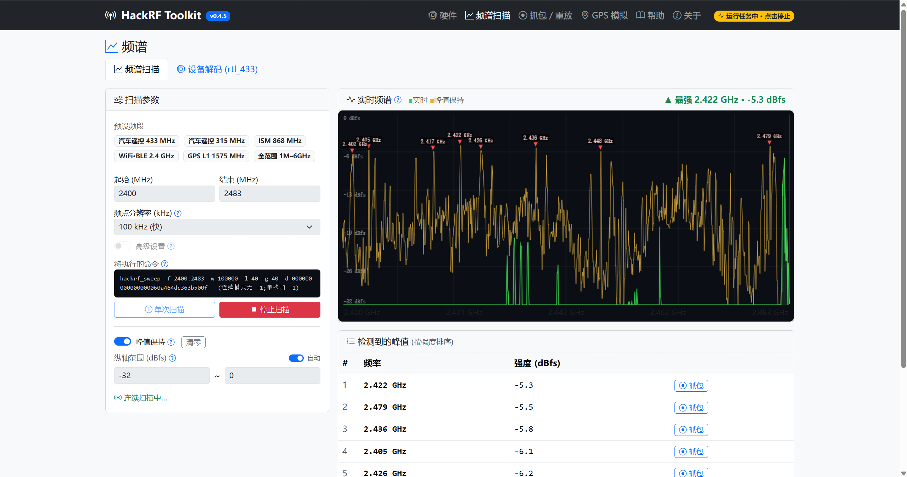
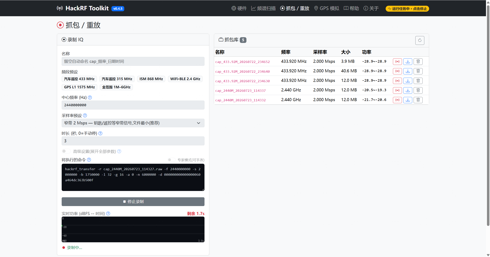
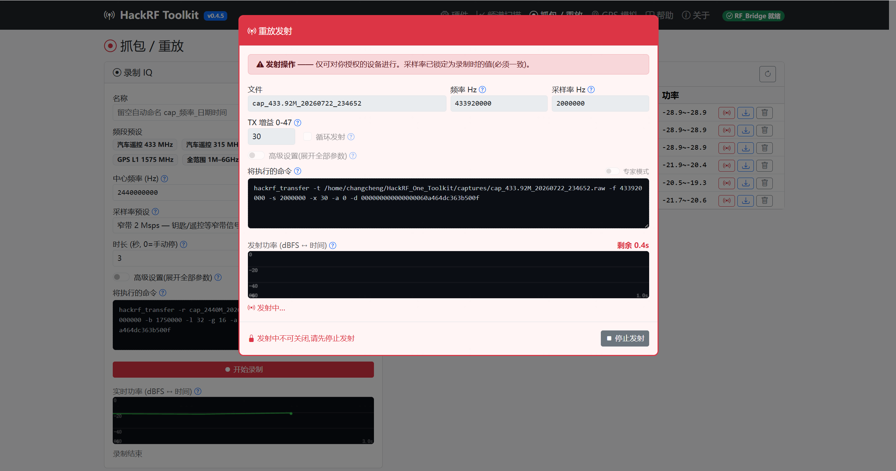
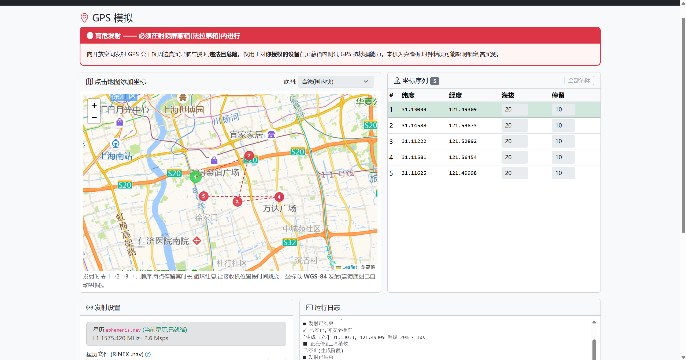
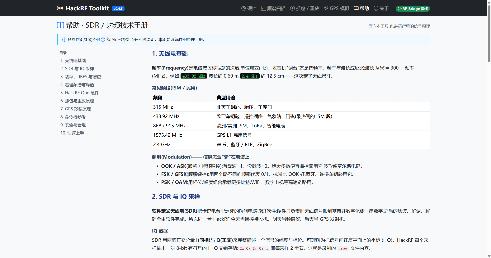

# HackRF One Toolkit

> 把 HackRF One 的一堆命令行工具装进浏览器 —— 频谱扫描、IQ 抓包/重放、ISM 设备解码、GPS 模拟,点点鼠标就能做,不用再背 `hackrf_transfer` 的一长串参数。

这是一个自托管的 **HackRF One Web 控制台**。你在网页上选频段、按按钮,后台帮你拼好并执行真实的 `hackrf_sweep` / `hackrf_transfer` / `rtl_433` / `gps-sdr-sim` 命令,把实时频谱、功率、解码结果推回页面。硬件可以在一台机器(如 Kali),你在另一台机器(如 Windows)用浏览器操作。

**定位:无线信号侦察 + 授权重放测试。** 发射类功能(重放、GPS)仅限你自己拥有或获得书面授权的设备;GPS 模拟必须在射频屏蔽箱内进行。详见 [安全与合规](#安全与合规)。

---

## 目录

- [它能做什么](#它能做什么)
- [快速开始](#快速开始)
- [使用介绍(逐页)](#使用介绍逐页)
  - [硬件设备](#1-硬件设备)
  - [频谱扫描 / 设备解码](#2-频谱扫描--设备解码)
  - [抓包 / 重放](#3-抓包--重放)
  - [GPS 模拟](#4-gps-模拟)
- [三种参数档:标准 / 高级 / 专家](#三种参数档标准--高级--专家)
- [架构](#架构)
- [安全与合规](#安全与合规)
- [项目结构](#项目结构)

---

## 它能做什么

| 模块 | 一句话 | 底层工具 |
| --- | --- | --- |
| **硬件设备** | 列出所有 HackRF(支持多台,按序列号选)、固件版本、工具链状态 | `hackrf_info` |
| **频谱扫描** | 预设频段一键扫描,实时频谱 + 峰值保持 + 峰值列表,一键把某频点带去抓包 | `hackrf_sweep` |
| **设备解码** | 直接解码周边 ISM 设备(胎压/气象站/门磁/温湿度…),结构化列表 | `rtl_433` |
| **抓包 / 重放** | 录 IQ 到文件、抓包库管理、一键重放(参数自动回填、采样率锁定防呆) | `hackrf_transfer` |
| **GPS 模拟** | 地图上点坐标发射伪造 GPS(单点连续发射固定位置;多点循环为实验性) | `gps-sdr-sim` |

---

## 快速开始

**硬件端依赖**(Kali / Debian 系):

```bash
sudo apt install hackrf rtl-433 soapysdr-module-hackrf   # 后者让 rtl_433 用上 HackRF
# 可选:GPS 模块需要 gps-sdr-sim(源码编译,放到 tools/gps-sdr-sim/)
git clone https://github.com/osqzss/gps-sdr-sim tools/gps-sdr-sim
gcc tools/gps-sdr-sim/gpssim.c -lm -O3 -o tools/gps-sdr-sim/gps-sdr-sim
```

**Python 3.11+**,依赖:`flask` / `waitress` / `requests`(见 `pyproject.toml`)。

**一键起停**(在接了 HackRF 的机器上运行):

```bash
./start.sh    # 启动 RF_Bridge(:30001,本机) + hackrf_web(:30000,局域网开放)
./stop.sh     # 停止,并清理残留的 hackrf_* / gps-sdr-sim 子进程
```

浏览器打开 **`http://<主机IP>:30000`**。Kali 桌面上有一个「HackRF Toolkit」图标,双击即可:没启动就先启动,已启动就直接开浏览器。

---

## 使用介绍(逐页)

顶部导航切换各模块。右上角状态灯:绿色「RF_Bridge 就绪」= 空闲;黄色「运行任务中·点击停止」= 有任务,点它可全局急停。

### 1. 硬件设备



进来先看这页,确认设备在线:

- 列出每台 HackRF 的序列号、固件、硬件版本;克隆板会有黄色提示(时钟精度可能影响 GPS)。
- 多台设备时点「设为当前」选用哪台,之后扫描/抓包/重放都用它。
- 下方「RF_Bridge 工具链」显示 `hackrf_*` / `rtl_433` / `gps-sdr-sim` 是否就位。

### 2. 频谱扫描 / 设备解码



**频谱扫描**页用来"看环境里有什么信号":

1. 点一个预设频段(如 `WiFi·BLE 2.4 GHz`),或手填起始/结束频率。
2. 点「连续扫描」(不停刷新)或「单次扫描」(扫一遍就停)。
3. 上图是实时频谱:绿线=此刻、暗黄线=**峰值保持**(把出现过的最强值定格,间歇信号也不会漏)。红色三角标出最多 8 个峰值。
4. 下方「检测到的峰值」按强度排序;点某行的 **「抓包」** 就直接跳到抓包页并把该频点填好。

> 「将执行的命令」框实时显示底层跑的 `hackrf_sweep …`,让你清楚发生了什么。

切到 **设备解码 (rtl_433)** 标签,填频率点「开始解码」,能把周边 ISM 设备(胎压、气象站、门磁…)直接解成一条条结构化记录。频谱扫描与设备解码共用天线、**互斥**——一个在跑,另一个按钮会变灰。

### 3. 抓包 / 重放



**录制**:选频段/采样率/时长(留空自动命名),点「开始录制」。下方「实时功率」是 dBFS 随时间的曲线,右上角有**倒计时**;安静时是底噪,目标一发射功率会明显跳升——看到跳升就说明录到了有效信号。开始键会变成「停止录制」。

右侧**抓包库**列出所有录制,每条可**重放 / 下载 .raw / 删除**。



点重放弹出发射窗口:频率、采样率**自动回填**(采样率锁定为录制值,防止收发不一致解不开);设 TX 增益,点「确认发射」。发射时:

- 有**倒计时**和发射功率曲线;
- 弹窗**不可关闭**(必须先「停止发射」),避免误操作;
- 其他页面会被整页锁定,提示到本页或右上角停止。

固定码遥控(老车库门、便宜遥控插座等)通常原样重放即可复现;滚动码一般无效。

### 4. GPS 模拟



> ⚠️ **必须在射频屏蔽箱(法拉第箱)内进行。** 向开放空间发射 GPS 违法且危险。

1. 地图上**点击添加多个坐标**(默认高德底图,国内快;坐标自动做 GCJ-02→WGS-84 纠偏,保证发射的是正确的 WGS-84)。
2. 右侧「坐标序列」里给每个点设**海拔**和**停留时长**。
3. 星历:点「尝试自动获取当天星历」或手动上传 RINEX `.nav`(样本星历也能出信号做通路验证,但真机锁定建议用当天星历)。
4. 点「生成并发射」。状态栏分两步显示进度:**步骤 1/2 生成信号中**(停留越长文件越大、越久),**步骤 2/2 发射中 + 倒计时**。
   - **单个坐标(推荐先这样验证)**:生成一个 =「停留」时长的连续文件,**发一次即停**(GPS 时间连续,接收机才能锁定)。建议停留 ≥120 秒、屏蔽箱内、TX 增益调高。
   - **多个坐标**:按 1→2→3→… 循环发射让位置随时间跳变——但这是**实验性**,每段会重置 GPS 时间且切换有间隙,接收机通常无法锁定。
   发射时地图和坐标表锁定,当前坐标在表格里高亮,运行日志实时打印。

---

## 三种参数档:标准 / 高级 / 专家

每个操作页都有三层,照顾"想省事"和"想全控"两种需求:

- **标准**:只露最常用的几项(频率、采样率、时长)。
- **高级**:展开全部参数(增益 LNA/VGA、带宽、放大器、天线偏置电源、设备选择…),每项旁边的 <kbd>?</kbd> 点开都有专业说明。
- **专家**:直接手改"将执行的命令"那行真实命令。手改内容经白名单校验(必须是对应工具、禁 shell 特殊字符、文件限制在抓包目录内),点开始就按你写的执行。

不熟悉 SDR 也不用担心:每个参数旁的 <kbd>?</kbd> 有即时说明,「帮助」页是一份系统的 SDR / 射频技术手册(频率、调制、IQ、dBFS、增益、重放/GPS 原理、命令参考、安全合规)。



---

## 架构

两个进程,HTTP + SSE 通信,严格分层:

```
浏览器 ──HTTP+SSE── hackrf_web (:30000) ──HTTP+SSE── RF_Bridge (:30001) ──子进程── hackrf_* / rtl_433 / gps-sdr-sim
             (只显示,不碰硬件)            (独占 HackRF,跑命令、解析输出、推实时流)
```

- **RF_Bridge**:独占硬件,把命令行工具作为"单任务"运行(半双工 → 同一时刻只能一个任务),解析 stdout/stderr 成事件,用 SSE 推给前端。
- **hackrf_web**:Flask + htmx + Bootstrap 控制台,不含任何硬件逻辑,把 `/api/*` 透明代理到 RF_Bridge。
- 前端可与硬件**不在同一台机器**——RF_Bridge 加 `--allow-lan` 即可从另一台机器的浏览器访问。

内部实现、API、数据流、扩展点见 **[TECHNICAL.md](TECHNICAL.md)**。

---

## 安全与合规

- **接收/扫描**(频谱、解码)一般合法(被动)。**发射**(重放、GPS)只可用于你**拥有或获得授权**的设备。
- **GPS 模拟必须在射频屏蔽箱内**,不得向开放空间辐射——会干扰周边真实导航与授时,违法且危险。
- 专家模式的手改命令经白名单校验;子进程一律以 argv 数组执行,从不经过 shell;抓包/重放文件名限定在 `captures/` 目录内。
- **无登录鉴权**,仅适合局域网可信环境;跨信任边界请自行加反向代理 + 认证。

---

## 项目结构

```text
HackRF_One_Toolkit/
├── src/
│   ├── rf_bridge/          后端:独占硬件的守护进程(:30001)
│   │   ├── hackrf.py       命令构建 + 输出解析 + 命令白名单校验
│   │   ├── jobs.py         单任务模型 + 子进程生命周期 + SSE 事件队列
│   │   ├── gps.py          GPS 流水线(星历 / 生成 / 发射)
│   │   └── app.py          Flask 路由 + SSE
│   └── hackrf_web/         前端:Flask + htmx + Bootstrap 控制台(:30000)
│       ├── app.py          页面路由 + 预设 + /api/* 透明代理
│       ├── static/app.js   HRF 命名空间(SSE / 图表 / 全局锁 / 内联帮助)
│       └── templates/      device / spectrum / capture / gps / help / about
├── captures/               录制的 .raw + .meta.json
├── gps/                    星历 + 生成的 wp*.bin
├── tools/gps-sdr-sim/      gps-sdr-sim 源码 + 二进制 + 样本星历
├── docs/                   截图
├── start.sh / stop.sh / launch.sh
├── README.md / TECHNICAL.md
└── pyproject.toml
```

---

作者:**cstriker1407** · 汽车网络安全工程师(ISO/SAE 21434)· <https://cstriker1407.blog.csdn.net>
